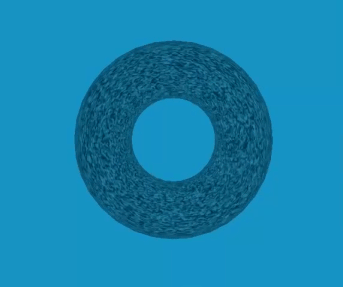

# AFrame Draw Shader

A shader to draw canvas [A-Frame](https://aframe.io) VR. Inspired by [@maxkrieger](https://github.com/maxkrieger)'s [`draw`](https://github.com/maxkrieger/aframe-draw-component) component.

**[DEMO](https://mayognaise.github.io/aframe-draw-shader/basic/index.html)**




## Properties

- Basic material's properties are supported.
- The property is pretty much same as `flat` shader besides `repeat`.

| Property | Description | Default Value |
| -------- | ----------- | ------------- |
| width | canvas width | 256 (target's width) |
| height | canvas height | 256 (target's height) |
| fps | fps to render | 60 |

For refference, please check the following links:
- [Material](https://aframe.io/docs/components/material.html)
- [Flat Shading Model](https://aframe.io/docs/core/shaders.html#Flat-Shading-Model)


## Events

- **`draw-render`** is called every framerate (fps). 

`event.detail` includes canvas's `ctx` (context) and `texture`.
`texture.needsUpdate = true` will call in the shader but
if your process is later than 3 ms after the event fired,
do `texture.needsUpdate = true` by yourself.

```js

this.el.addEventListener('draw-render', function(event) {

  // draw!
  var ctx = event.detail.ctx
  var texture = event.detail.texture

  // drawing...
  ctx.rect(20,20,150,100)
  ctx.stroke()
  // still drawing...

  // if finish draw later
  texture.needsUpdate = true

})

```

## Usage

### Browser Installation

Install and use by directly including the [browser files](dist):

```html
<head>
  <title>My A-Frame Scene</title>
  <script src="https://aframe.io/releases/0.2.0/aframe.min.js"></script>
  <script src="https://rawgit.com/mayognaise/aframe-draw-shader/master/dist/aframe-draw-shader.min.js"></script>
  <script>
    /**
     * noise component example
     */
    AFRAME.registerComponent('noise', {
      dependencies: [ ],
      schema: { },
      init () {
        this.el.addEventListener('draw-render', this.render.bind(this))
      },
      update () { },
      remove () { },
      pause () { },
      play () { },
      render (e) {
        var ctx = e.detail.ctx,
            w = ctx.canvas.width,
            h = ctx.canvas.height,
            idata = ctx.createImageData(w, h),
            buffer32 = new Uint32Array(idata.data.buffer),
            len = buffer32.length,
            i = 0
        for(; i < len;)
            buffer32[i++] = ((255 * Math.random())|0) << 24
        ctx.putImageData(idata, 0, 0)
      }
    })
  </script>
</head>

<body>
  <a-scene>
    <a-entity geometry="primitive:box;" material="shader:draw;" noise=""></a-entity>
  </a-scene>
</body>
```

### NPM Installation

Install via NPM:

```bash
npm i -D aframe-draw-shader
```

Then register and use.

```js
import 'aframe'
import 'aframe-draw-shader'
```


